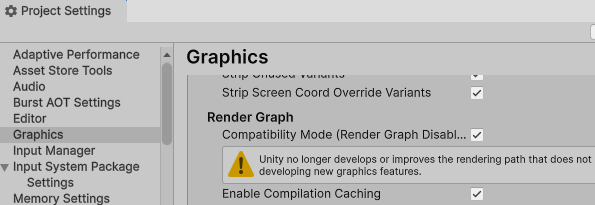
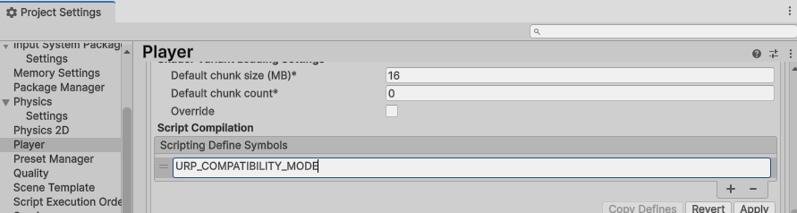
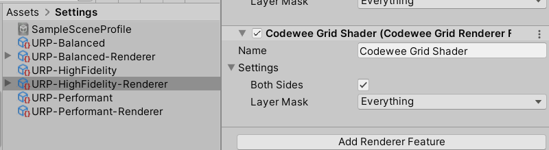

# CodeWee Grid Shader (URP)

## Summary

A highly customizable and lightweight grid shader for the Universal Render Pipeline(URP). Supports UI, meshes, and flat surfaces, with configurable main and sub-grid lines, alpha background, and wireframe-style rendering.

## Description

**Grid Shader** is a versatile and performance-friendly shader package designed for Unity's Universal Render Pipeline(URP). Whether you're creating visual debugging tools, wireframe-style art, architectural layouts, or stylized UI, this shader offers full flexibility to draw clean, customizable grid lines directly on any surface.

Easily apply it to 2D planes, 3D meshes, or UI elements to render precision-aligned grid overlays. Configure grid density per axis (X and Y), line color, thickness, sub-grid steps, and even background color with transparency. Sub-grids allow for detailed spacing within your main grid, offering further visual control for prototyping, design tools, or technical illustrations.

When applied to meshes with well-defined UV mapping, Grid Shader can simulate a clean and stylized wireframe effect, making it ideal for visual debugging or creative rendering styles.

Ideal for developers and artists who need real-time grid visualization with total aesthetic control.

Supports the following Unity versions:

	- Unity 2021 
	- Unity 2022 
	- Unity 6000.0 (Unity 6.0)
	- Unity 6000.2 (Unity 6.2)
	- Unity 6000.3 (Unity 6.3)

## Technical Details

- Supported Targets: Meshes, Planes, UI Elements (UGUI/Canvas)
- Grid Settings:
  - Adjustable number of grid cells (X and Y)
  - Main grid line thickness and color with alpha control
  - Sub-grid step intervals for both axes
  - Sub-grid line color with alpha control and thickness
  - Transparent background color with alpha control
- Special Effects:
  - Mesh-compatible for stylized wireframe effects based on well-defined UV mapping
  - Fully customizable in real time through material properties
- Performance: Optimized for real-time applications

## Key Features

- ✅ Customizable Main Grid - Control grid count, color with transparency, and line thickness on both X and Y axes
- ✅ Advanced Sub-Grid System - Define step sizes and visual styles for sub-grids independently
- ✅ Alpha Background Color - Set transparent or semi-transparent backgrounds for clean overlays
- ✅ Mesh Compatibility - Apply to any mesh for a wireframe-style visualization, rendered along - well-defined UV mapping
- ✅ UI Integration - Works seamlessly with Unity's Canvas UI for HUDs, overlays, and editors
- ✅ Real-Time Adjustment - All parameters exposed for live tuning in the Inspector
- ✅ Lightweight & Optimized - Minimal performance impact, suitable for runtime use
- ✅ Plug & Play - No scripting required; ready-to-use material presets includedadvanced use

## Quick Start

> **Important**: In Unity 6.0 or higher, you must enable the Compatibility Mode in `Project Settings` > `Graphics`.

> **Important**: In Unity 6.3 or higher, you must enable the Compatibility. To enable Compatibility Mode, go to `Edit > Project Settings > Player` and add `URP_COMPATIBILITY_MODE` to the Scripting Define Symbols before enable the Compatibility Mode in `Project Settings` > `Graphics`.

> **NOTE** : To apply Both Sides, add the **CodeWee Grid Renderer Feature** in your **URP Asset**'s Inspector window as shown in the image below, and then enable the **Both Sides** checkbox.

### Demo Scenes

- You'll find various demo scenes in the `Assets/CodeWee/cwGridShader(URP)/Demo/Scenes` folder. Feel free to explore them to see how the asset works in action.

### Sample Materials

- You can find sample materials for this shader in the `Assets/CodeWee/cwGridShader(URP)/Materials` folder.

### Shader Source Code

- The original source code of the shader is located in the `Assets/CodeWee/cwGridShader(URP)/Shaders` folder.

